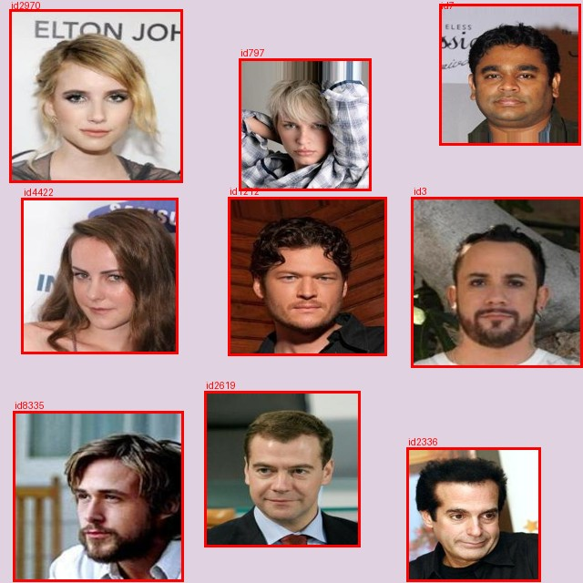
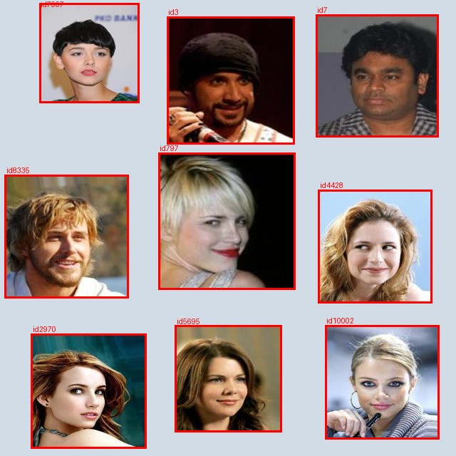

# Milestone 2 — Detection Dataset Construction

## 1. Setup recap

- **Goal:** pivot from single-face classification (Milestone 1) to the detection
  half of the system — construct a synthetic multi-celebrity image dataset,
  annotate it with YOLO-format bounding boxes, apply a documented augmentation
  strategy, and produce a clean train/validation/test split for Milestone 3's
  YOLOv8 fine-tuning.
- **Identity pool:** per the assignment's specific instruction, each 3x3 grid
  uses **9 unique identities drawn from the whole class pool** (not just our
  own team's 4 IDs), pulled from the class-wide identity spreadsheet:

  | Group | Names | Celeb IDs |
  |---|---|---|
  | 1 | Dario Garza, Yosephine Tong, Murat Akca | 797, 10002, 5695 |
  | 2 (ours) | Abdellah Faleh, Samuel Tong, Jin-Woo Hong, Tristan Lyons | 3, 1212, 7, 8335 |
  | 3 | Julia Rasmussen, Rhea Paul, Mus Ab Irfan Yilmaz, Masato Kan | 4422, 2970, 7007, 2336 |
  | 4 | David Fung | 4428 |
  | 5 | Jiasong Zhang | 2619 |

  13 identities total, giving enough variety that our 6 required grids each
  draw a different 9-identity combination without repeating an arrangement.
- **Deliverable count:** 6 grid images total — 2 included in this report, plus
  4 additional ones produced separately for the TA to aggregate across groups
  ahead of Milestone 3.

## 2. Grid composition

Each grid places 9 unique celebrity face crops (drawn from the class pool
above) into a 3x3 layout, resized to 640x640 pixels — YOLOv8's default input
size. Placement, scale, and background are randomized per grid (see
`src/build_synthetic_detection_dataset.py`) so no two grids share the same
arrangement:

- Face scale: 65-92% of its grid cell, varied per face
- Placement: randomized offset within the cell (faces are not always centered)
- Background: one of several plain fill colors, varied per grid

Every face has a corresponding YOLO-format label row
(`class_id x_center y_center width height`, normalized to the 640x640 canvas),
generated directly from the placement coordinates used to compose the grid, so
the boxes are exact by construction rather than hand-annotated.

## 3. Sample annotated grids

Two of the six composed grids, with bounding boxes drawn on top for visual
verification (see `notebooks/05_detection_dataset_preparation.ipynb` for the
full inline rendering of all sample grids and their labels):




## 4. Augmentation strategy

Applied to every grid to increase effective training diversity. Every
transform is bounded so faces stay inside the frame, and bounding boxes are
mathematically recomputed to match each transform (not simply copied) — see
`src/augment_and_split_detection_dataset.py`:

| Augmentation | Parameters | Why |
|---|---|---|
| Horizontal flip | p = 0.5 | Faces are roughly left-right symmetric — free extra viewpoint diversity, label-safe (mirrors x-coordinates only) |
| Bounded rotation | ±8° | Simulates a slightly tilted camera/photo; boxes recomputed as the axis-aligned bound of the rotated face corners |
| Brightness jitter | 0.85x–1.15x | Simulates different lighting conditions across the shared backgrounds; pixel-only, does not affect box coordinates |
| Contrast jitter | 0.85x–1.15x | Same rationale as brightness jitter |
| Centered zoom | 0.95x–1.05x | Simulates minor camera distance/framing differences; boxes rescaled around the image center to match |

Boxes are clipped to the 640x640 frame and dropped only if less than 10% of
their original area would remain visible — this does not occur in practice at
these bounded parameters for a centered 3x3 grid. We visually verified the
augmentation preserves label alignment by rendering an original grid next to
its augmented counterpart with boxes drawn on both (see the notebook, Section
4) — every box correctly rotates/rescales along with its face.

## 5. Train / validation / test split

Split at the **base grid** level, not per augmented copy — every augmented
version of a given grid stays in the same split, which is what prevents image
leakage across train/val/test. With 6 base grids, 4 go to train, 1 to
validation, and 1 to test; each base grid contributes 1 original + 4 augmented
copies:

| Split | Base grids | Total images |
|---|---|---|
| train | 4 | 20 |
| val | 1 | 5 |
| test | 1 | 5 |

This was verified programmatically (`split_manifest.csv` + an assertion in the
notebook) — no base grid's images appear in more than one split.

## 6. Dataset QA and validation

As a final review step, the detection dataset was checked for annotation
consistency and split integrity. Sample synthetic images were rendered with
their YOLO bounding boxes overlaid to confirm that the boxes remained aligned
with each face after composition and augmentation.

The train/validation/test split was also checked at the base-grid level so that
augmented versions of the same synthetic grid do not appear in multiple splits.
YOLO labels use normalized coordinates and the shared identity-to-class mapping
stored with the dataset.

## 7. Reproducing this dataset

```bash
python src/extract_class_pool_images.py 3 7 1212 8335 2619 797 10002 5695 4422 2970 7007 2336 4428
python src/build_synthetic_detection_dataset.py --ids 3 7 1212 8335 2619 797 10002 5695 4422 2970 7007 2336 4428 --n-grids 6
python src/augment_and_split_detection_dataset.py --n-aug 4
```

or run `notebooks/05_detection_dataset_preparation.ipynb` end-to-end, which
performs all three steps with inline visualizations of sample annotated grids,
the before/after augmentation comparison, and the split's leak-free
verification.

## 8. Dataset location and what's next

The finished dataset lives in `detection_dataset/` (see the repository layout
in `README.md`): `train/`, `val/`, `test/` (each with `images/` and `labels/`),
`classes.json` (identity_id → class_id mapping, shared with the group for
cross-team aggregation), and `manifest.csv` / `split_manifest.csv` for full
provenance. This is the exact dataset Milestone 3 will fine-tune YOLOv8 on to
report mAP@0.5, mAP@0.5:0.95, IoU, precision, and recall.
