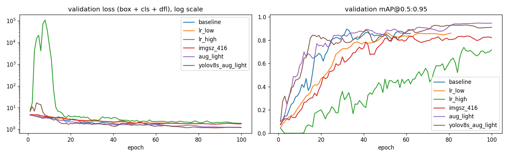
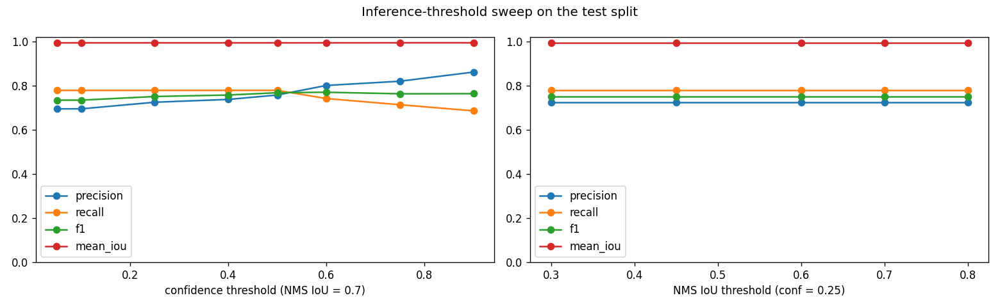
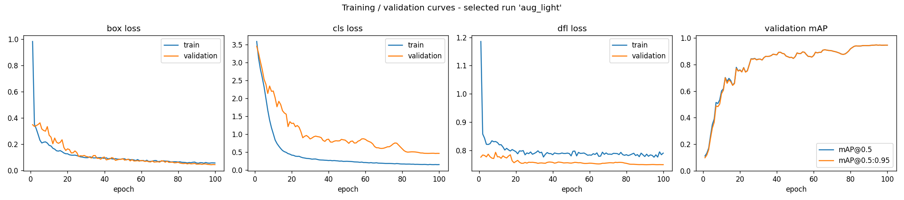

# Project 1 - Milestone 3: YOLOv8 Transfer Learning and Evaluation

IE7615 - Group 02

## 1. What we did

**Goal.** Each test image is a 3x3 grid of 9 celebrity faces from CelebA. The model must draw a box
around every face (*localization*) and say which of our 13 celebrities it is (*identification*). We used
**YOLOv8**, an object-detection model, starting from a version already trained on the COCO dataset and
fine-tuning it on our faces (*transfer learning*). Each celebrity is one YOLO class.

**Why we enlarged the dataset.** We first trained on our Milestone 2 dataset (30 images). The model
learned where faces are, but not who they are. The reason: each celebrity has about 25 photos, but those
30 images used only about 4 of them, so the model memorized those few photos. The test set was also
missing 4 of the 13 celebrities.

So we rebuilt the dataset with the **same Milestone 2 method** (same celebrities, same 640 px 3x3 grids,
same random size and position for each face; script `src/build_m3_scaled_dataset.py`). We changed only two
things:

- **We split each celebrity's photos first**: 70% for training, 15% for validation, 15% for testing.
  No photo is used in more than one split, so test faces are always new to the model.
- **We made more grids**: 120 for training, 12 for validation, 12 for testing (108 test faces). Every
  celebrity appears in every split, and each one has about 17 training photos.

The TA (Priyanka Raj Rajendran) approved this change on October 6, 2026.

**How we trained.** Up to 100 epochs (passes over the training data), batch size 16, random seed 42.
Training stops early if the validation score does not improve for 30 epochs. We set the optimizer to
**AdamW** ourselves, because YOLOv8's default ("auto") ignores the learning rate we give it, which would
make our learning-rate tests meaningless. We trained 6 versions with different settings (section 3) and
picked the best one **using the validation set only**. The test set was used once, at the end, to report
the final numbers. The chosen version is **`aug_light`** (YOLOv8n with lighter data augmentation). Its
weights are in `models/celeba_yolov8_best.pt`.

## 2. Test results

| Metric | Value |
|---|---|
| mAP@0.5 | 0.879 |
| mAP@0.5:0.95 | 0.876 |
| Precision (Ultralytics) | 0.849 |
| Recall (Ultralytics) | 0.759 |
| Mean IoU (correct detections) | 0.993 |
| Faces located (any identity) | 108 / 108 |
| **Faces correctly identified** | **84 / 108 (77.8%)** |

**What the metrics mean.**

- **IoU** (Intersection over Union) measures how well a predicted box matches the true box: 1.0 means a
  perfect match. Ours is 0.993, so the boxes are almost exact.
- **Precision** = of all the boxes the model drew, how many were correct. **Recall** = of all the real
  faces, how many the model found with the right name.
- **mAP@0.5** (mean Average Precision) is the standard detection score, from 0 to 1. It averages precision
  over all confidence levels and all 13 celebrities, counting a box as correct if its IoU is at least 0.5.
  **mAP@0.5:0.95** is the same but with stricter box-overlap rules.

**The clearest number is "84 of 108 faces correctly identified" (77.8%).** mAP can look better than this,
because it also gives credit when the right name is only the model's second guess. For example, celeb_3
has mAP@0.5 = 0.995, yet 4 of its 8 test faces were given a different name. Precision and recall also
differ slightly by method. Ultralytics reports them at its best confidence setting (0.849 / 0.759). Our
own count at confidence 0.25 gives 0.724 / 0.778, with 24 faces given the wrong name and 8 extra boxes.
Results for each celebrity are in Appendix A.

**The bigger dataset made the biggest difference** (each row is tested on its own dataset's test set):

| model / data | test mAP50 | test mAP50-95 | precision | recall |
|---|---|---|---|---|
| baseline, Milestone 2 data (20/5/5 images) | 0.232 | 0.150 | 0.452 | 0.400 |
| baseline, scaled data (120/12/12 grids) | 0.799 | 0.789 | 0.648 | 0.824 |
| aug_light (selected), scaled data | 0.879 | 0.876 | 0.849 | 0.759 |

## 3. Hyperparameter sweep

We changed one setting at a time from the baseline: learning rate (`lr0`), image size (`imgsz`), how
strongly the training images are randomly altered (augmentation), and model size (YOLOv8n vs the larger
YOLOv8s). Details are in Appendix B.

| run | model | lr0 | imgsz | epochs_run | val mAP50 | val mAP50-95 | test mAP50 | test mAP50-95 |
|---|---|---|---|---|---|---|---|---|
| baseline | yolov8n | 0.001 | 640 | 62 | 0.897 | 0.896 | 0.799 | 0.789 |
| lr_low | yolov8n | 0.0002 | 640 | 81 | 0.864 | 0.863 | 0.861 | 0.855 |
| lr_high | yolov8n | 0.005 | 640 | 100 | 0.737 | 0.737 | 0.687 | 0.682 |
| imgsz_416 | yolov8n | 0.001 | 416 | 100 | 0.835 | 0.835 | 0.847 | 0.842 |
| aug_light | yolov8n | 0.001 | 640 | 100 | 0.947 | 0.947 | 0.879 | 0.876 |
| yolov8s_aug_light | yolov8s | 0.001 | 640 | 100 | 0.933 | 0.933 | 0.936 | 0.932 |

We also tested two settings that do not need retraining: the **confidence threshold** (how sure the model
must be before it draws a box) and the **NMS IoU threshold** (how much two boxes can overlap before the
weaker one is removed). Tables are in Appendix C.

## 4. Training curves (chosen model)

## 5. What the results show

**Finding faces is solved; naming them is the hard part.** The model found all 108 test faces, and its
boxes are almost exact (IoU 0.993). This is also why mAP@0.5 and mAP@0.5:0.95 are nearly equal: the boxes
pass even the strictest overlap rule. Part of this comes from our synthetic grids, where each face is a
clean square on a plain background; real group photos would be harder. Almost all mistakes are **wrong
names**: 24 faces were found but named wrongly, 0 were missed, and there were 8 extra boxes.

The training curves show the same thing. The box loss goes down for both training and validation. The
classification loss (naming) goes down to 0.16 on training but stays at 0.47 on validation. This gap means
the model is **overfitting**: it remembers its ~17 training photos per celebrity better than it recognizes
new ones.

Some celebrities are harder than others. celeb_4428 was misnamed on 5 of 8 test faces, and celeb_3 and
celeb_5695 on 4 of 8. The mistakes come mostly from look-alike pairs: celeb_3 with celeb_7007 or celeb_1212,
celeb_4428 with celeb_2970, and celeb_5695 with celeb_4422. For our own group's celebrities, celeb_1212 and
celeb_8335 were named correctly every time, celeb_7 on 7 of 8, and celeb_3 was one of the most confused.

**More data helped the most.** With the same settings, the original 30-image dataset gives test
mAP@0.5 = 0.232, and the larger dataset gives 0.799. A teammate's separate YOLOv8n run on the original
dataset (`runs/detect/celeba_yolov8n_milestone2/`) got 0.249, which confirms this. Because test photos are
never used in training, our score shows how well the model recognizes known celebrities in **new**
photos, which is what the final system needs.

**What each setting did** (validation mAP@0.5; for augmentation and model size, mAP@0.5:0.95, which is almost the same here):

- **Learning rate:** 5x higher (0.005) gave 0.737, worse than the baseline's 0.897. 5x lower (0.0002) gave
  0.864. The default 0.001 worked best.
- **Image size:** smaller images (416 px) gave 0.835, because the faces become smaller and harder to tell apart.
- **Augmentation:** lighter random changes gave the best result, 0.947 (mAP@0.5:0.95), probably because our
  grids already vary face size and position.
- **Model size:** the larger YOLOv8s scored 0.933 on validation, slightly below YOLOv8n's 0.947, so we kept
  YOLOv8n. On the test set, however, YOLOv8s scored clearly higher (0.936 vs 0.879). We did not switch,
  because choosing the model by its test score would make the test result unfairly optimistic. YOLOv8s is
  the first thing to try again in Milestone 4.
- **Confidence threshold:** raising it from 0.05 to 0.90 made the model more careful: precision rose from
  0.694 to 0.860, but recall fell from 0.778 to 0.685. The best balance (F1) was at 0.60.
- **NMS IoU threshold:** no effect, because faces in a grid never overlap.

**Limits and next steps.** Of the 12 test grids, 4 were near-perfect (at least 8 of 9 faces right) and
8 were partly right. We also tested harder, edited images. The model failed on **much smaller faces**
(1 of 18 right) and **crowded images** (3 of 18), and did better on dark images (10 of 18) and blurry
images (10 of 18). It struggles with small faces because during training, faces always filled 65-92% of a
grid cell. For Milestone 4 we plan to train with smaller and more crowded faces, and to compare this
detector with a two-step system: first find the faces, then name them with our Milestone 1 classifier.

## 6. Gallery and demo

- **Gallery:** `results/milestone3/gallery/README.md` has 19 example images with boxes and names, each
  labelled success, partial or failure, with a short caption.
- **Live demo:** run `python src/demo_detect.py --app` for a web page where you can upload an image, or
  `python src/demo_detect.py --source <image>` from the command line. Instructions are in the README.

---

## Appendix A. Per-identity test results

"(ours)" marks Group 02's identities.

| class | identity | test faces | precision | recall | mAP50 | mAP50-95 | mean IoU |
|---|---|---|---|---|---|---|---|
| 0 | celeb_3 (ours) | 8 | 1 | 0.543 | 0.995 | 0.995 | 0.994 |
| 1 | celeb_7 (ours) | 8 | 0.991 | 1 | 0.995 | 0.995 | 0.994 |
| 2 | celeb_797 | 8 | 0.968 | 0.750 | 0.927 | 0.927 | 0.992 |
| 3 | celeb_1212 (ours) | 9 | 0.892 | 1 | 0.995 | 0.995 | 0.994 |
| 4 | celeb_2336 | 8 | 1 | 0.933 | 0.995 | 0.995 | 0.994 |
| 5 | celeb_2619 | 9 | 0.925 | 0.444 | 0.802 | 0.787 | 0.991 |
| 6 | celeb_2970 | 8 | 0.704 | 0.750 | 0.792 | 0.792 | 0.990 |
| 7 | celeb_4422 | 9 | 0.631 | 0.556 | 0.788 | 0.788 | 0.989 |
| 8 | celeb_4428 | 8 | 0.727 | 0.375 | 0.641 | 0.638 | 0.994 |
| 9 | celeb_5695 | 8 | 0.817 | 0.625 | 0.683 | 0.666 | 0.993 |
| 10 | celeb_7007 | 9 | 0.722 | 0.889 | 0.931 | 0.931 | 0.994 |
| 11 | celeb_8335 (ours) | 8 | 0.871 | 1 | 0.954 | 0.954 | 0.993 |
| 12 | celeb_10002 | 8 | 0.787 | 1 | 0.928 | 0.928 | 0.994 |

## Appendix B. Sweep configurations

| run | augmentation | what changes |
|---|---|---|
| baseline | Ultralytics defaults | Reference: AdamW lr0=0.001, 640 px, default online augmentation |
| lr_low | Ultralytics defaults | Learning rate 5x lower |
| lr_high | Ultralytics defaults | Learning rate 5x higher |
| imgsz_416 | Ultralytics defaults | Smaller input resolution (faster, smaller faces) |
| aug_light | mosaic=0.0, scale=0.2, translate=0.05, hsv_h=0.005, hsv_s=0.3, hsv_v=0.2 | Lighter online augmentation (no mosaic, gentler jitter) |
| yolov8s_aug_light | mosaic=0.0, scale=0.2, translate=0.05, hsv_h=0.005, hsv_s=0.3, hsv_v=0.2 | Larger model (YOLOv8s, ~3x parameters) with lighter augmentation |

## Appendix C. Inference-threshold tables (test split)

| conf | predictions | correct | wrong_identity | false_positive | missed | precision | recall | f1 |
|---|---|---|---|---|---|---|---|---|
| 0.050 | 121 | 84 | 24 | 13 | 0 | 0.694 | 0.778 | 0.734 |
| 0.100 | 121 | 84 | 24 | 13 | 0 | 0.694 | 0.778 | 0.734 |
| 0.250 | 116 | 84 | 24 | 8 | 0 | 0.724 | 0.778 | 0.750 |
| 0.400 | 114 | 84 | 23 | 7 | 1 | 0.737 | 0.778 | 0.757 |
| 0.500 | 111 | 84 | 23 | 4 | 1 | 0.757 | 0.778 | 0.767 |
| 0.600 | 100 | 80 | 19 | 1 | 9 | 0.800 | 0.741 | 0.769 |
| 0.750 | 94 | 77 | 17 | 0 | 14 | 0.819 | 0.713 | 0.762 |
| 0.900 | 86 | 74 | 12 | 0 | 22 | 0.860 | 0.685 | 0.763 |

| nms_iou | predictions | correct | false_positive | precision | recall | f1 |
|---|---|---|---|---|---|---|
| 0.300 | 116 | 84 | 8 | 0.724 | 0.778 | 0.750 |
| 0.450 | 116 | 84 | 8 | 0.724 | 0.778 | 0.750 |
| 0.600 | 116 | 84 | 8 | 0.724 | 0.778 | 0.750 |
| 0.700 | 116 | 84 | 8 | 0.724 | 0.778 | 0.750 |
| 0.800 | 116 | 84 | 8 | 0.724 | 0.778 | 0.750 |

Per-run logs (`results.csv`, `args.yaml`, Ultralytics plots) are in `results/milestone3/train_logs/`.
