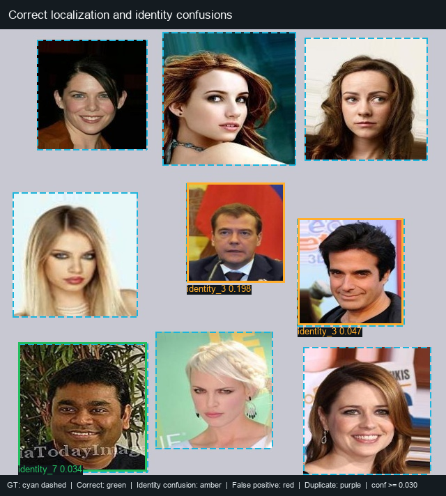
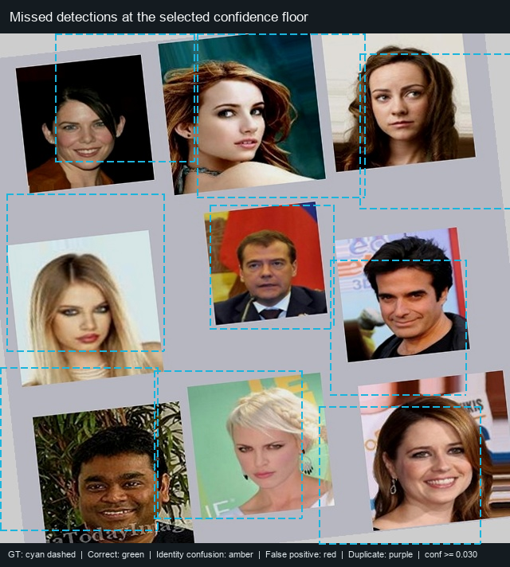
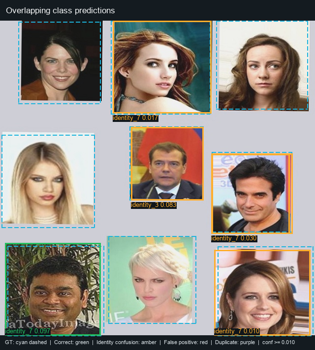

# YOLOv8 Test Detection Gallery

Rendered with the best YOLOv8n checkpoint using NMS IoU 0.50. Predicted boxes
include the predicted identity and confidence score. Cyan dashed boxes show the
ground-truth labels; green indicates a same-identity match at IoU >= 0.50,
amber indicates an identity confusion, red indicates a false positive, and
purple indicates a duplicate detection.

## Correct Detection and Identity Confusions



On `grid_0006_orig`, identity 7 is correctly localized (confidence 0.034,
IoU 0.99). The model predicts identity 3 over the identity-2619 face
(confidence 0.198, IoU 0.96) and over the identity-2336 face (confidence
0.047, IoU 0.98), showing that localization can be strong while identity
classification is wrong.

## Missed Detections



On `grid_0006_aug1`, no predictions survive the confidence floor of 0.03,
although all nine ground-truth boxes are present. This illustrates how a
higher confidence floor can turn low-confidence predictions into missed faces.

## Overlapping Predictions



On `grid_0006_aug4` at confidence floor 0.01, identity-3 and identity-7
predictions overlap the identity-2336 face region; their predicted boxes have
IoU 0.95. The source grid places faces in separate cells, so this is overlapping
model output rather than overlapping ground-truth faces.

All five test images are augmented variants of the same base grid, so this
gallery illustrates observed model behavior but does not represent five
independent scenes. Regenerate the images with:

```bash
python src/render_yolo_test_gallery.py
```
