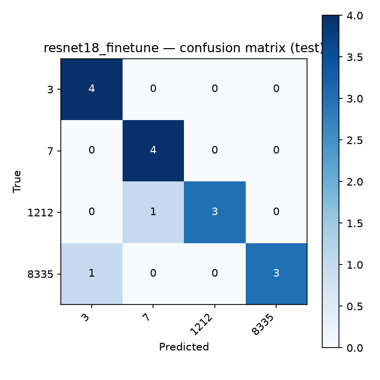
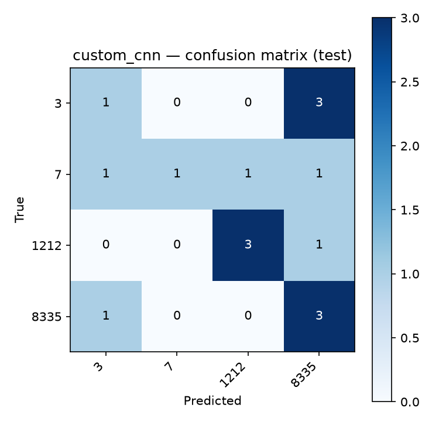
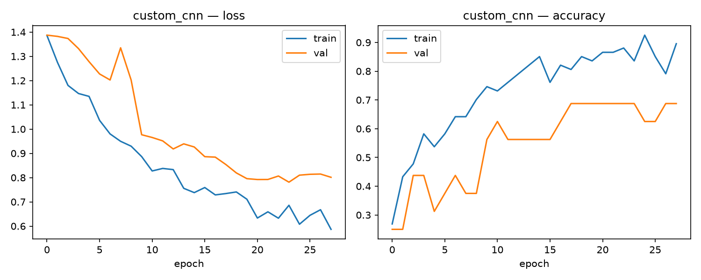
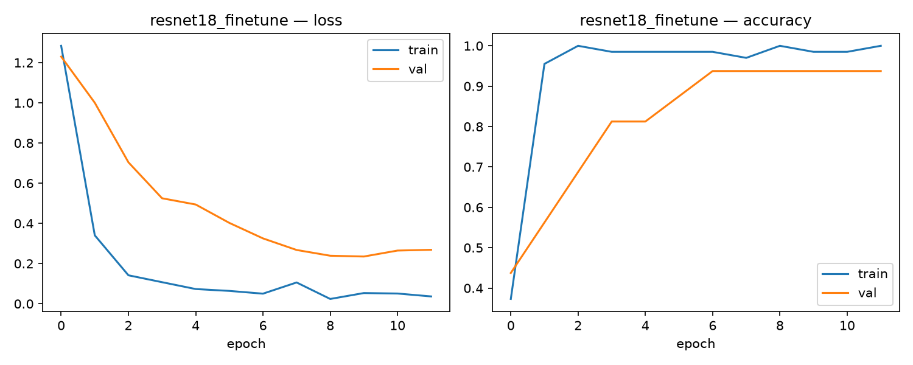

# Training Results — Milestone 1 Classification Baseline

## 1. Setup recap

- **Identities:** 4 CelebA identities — the IDs each team member individually claimed
  for the class-wide identity-pooling task (23-25 images each):

  | Identity ID | # Images | Claimed by | Dominant attributes |
  |---|---|---|---|
  | 3 | 25 | Abdellah Faleh | Male, Wearing_Hat |
  | 7 | 24 | Jin-Woo Hong | Male, Black_Hair |
  | 1212 | 25 | Samuel Tong | Male, Black_Hair |
  | 8335 | 25 | Tristan Lyons | Male, Brown_Hair |

- **Split:** stratified 70/15/15 per identity → train 17/16/17/17 (67 total),
  val 4/4/4/4 (16 total), test 4/4/4/4 (16 total)
- **Preprocessing:** 128x128 resize, ImageNet normalization, train-only augmentation
  (horizontal flip, light color jitter)
- **Models compared:**
  1. Custom CNN (from scratch) — `src/models.py::CustomCNN`
  2. ResNet18 (fine-tuned, ImageNet-pretrained) — `src/models.py::build_resnet18`

**Note on identity change:** these 4 identities replace an earlier, independently
diversity-selected 5-identity set (6439/5640/6195/5485/7087). The group's Milestone 1
subset was updated to use the individually-claimed IDs per the class-wide
identity-pooling task, so both models were retrained from scratch on this new,
harder subset (3 of 4 identities are male, several share hair-color attributes,
reducing the visual separability that made the earlier set easier to classify).

## 2. Model comparison table

| Model | Test Accuracy | Val Accuracy | Params | Size (MB) | Train Time (s) |
|---|---|---|---|---|---|
| **ResNet18 (fine-tuned)** | **0.875** | 0.9375 | 11,178,564 | 42.64 | 461.3 |
| Custom CNN (from scratch) | 0.500 | 0.6875 | 1,207,588 | 4.61 | 927.1 |

## 3. Per-class performance

### ResNet18 (fine-tuned) — best model

| Identity | Precision | Recall | F1-score | Support |
|---|---|---|---|---|
| 3 | 0.80 | 1.00 | 0.889 | 4 |
| 7 | 0.80 | 1.00 | 0.889 | 4 |
| 1212 | 1.00 | 0.75 | 0.857 | 4 |
| 8335 | 1.00 | 0.75 | 0.857 | 4 |
| **accuracy** | | | **0.875** | 16 |
| macro avg | 0.90 | 0.875 | 0.873 | 16 |
| weighted avg | 0.90 | 0.875 | 0.873 | 16 |

Confusion pattern: identities 1212 and 8335 each had one test image misclassified as
identity 3, while identities 3 and 7 were both classified perfectly (all 4 test images
correct). This is consistent with 3 and 7 having more visually distinct dominant
attributes (Wearing_Hat and Black_Hair respectively) than 1212 and 8335, whose
attribute profiles overlap more with each other and with 3.

### Custom CNN — for comparison

| Identity | Precision | Recall | F1-score | Support |
|---|---|---|---|---|
| 3 | 0.33 | 0.25 | 0.286 | 4 |
| 7 | 1.00 | 0.25 | 0.400 | 4 |
| 1212 | 0.75 | 0.75 | 0.750 | 4 |
| 8335 | 0.38 | 0.75 | 0.500 | 4 |
| **accuracy** | | | **0.500** | 16 |
| macro avg | 0.61 | 0.50 | 0.484 | 16 |
| weighted avg | 0.61 | 0.50 | 0.484 | 16 |

The custom CNN struggled considerably more on this harder 4-identity subset,
correctly classifying only 8 of 16 test images. Its confusion is concentrated
around identity 3 and identity 8335, both of which absorbed several
misclassifications from other identities — consistent with the model failing to
learn a clean decision boundary between the more visually similar Black_Hair/
Brown_Hair identities (7, 1212, 8335) with only ~16-17 training images per class.

## 4. Training curves

The ResNet18 fine-tune shows both training and validation loss dropping sharply in
the first 2 epochs and validation accuracy climbing to 93.75% by epoch 6, then
plateauing (12 epochs total before early stopping) — a clean, stable transfer-learning
curve. The custom CNN's curves show slower, noisier learning: training accuracy climbs
steadily to ~90% by epoch 28, but validation accuracy plateaus around 68.75% with
visible gaps between train and validation loss opening up after epoch 15 — a mild
overfitting signature consistent with training a model from scratch on only 16-17
images per class. No collapse to a single class occurred this time (unlike the
original custom CNN training pass on the previous identity set), confirming the
earlier augmentation/learning-rate/dropout fixes (lighter augmentation, lr=3e-4,
dropout=0.3, batch size 16) remain effective on this new, harder identity subset.

## 5. Best-model justification

The **ResNet18 fine-tuned model** is the model we carry forward into Milestone 2/3,
achieving 87.5% test accuracy versus the custom CNN's 50% on this new 4-identity
subset (3, 7, 1212, 8335 — the IDs individually claimed by team members for the
class-wide identity-pooling task, replacing the earlier independently-selected
5-identity set).

This subset is meaningfully harder than the original one: 3 of the 4 identities are
male, and several share overlapping dominant attributes (Black_Hair appears for both
identity 7 and 1212), reducing the visually-distinctive cues a classifier can rely on.
This is reflected in both models' lower accuracy compared to the original subset
(ResNet18 dropped from 95% to 87.5%; the custom CNN dropped from 85% to 50%).

The gap between the two architectures widened considerably on this harder subset
(37.5 percentage points, versus 10 points on the original subset), which we attribute
to ResNet18's ImageNet-pretrained features already encoding fine-grained,
general-purpose visual structure that transfers well even when classes are visually
similar, while the custom CNN — learning everything from scratch on only ~16-17
training images per class — has far less capacity to disentangle subtle,
overlapping visual cues. This came at a real cost: ResNet18 has ~9.3x more parameters
(11.2M vs 1.2M) and is ~9.3x larger on disk (42.64MB vs 4.61MB); training time was
comparable in the other direction, with the custom CNN taking about 2x longer
(927.1s vs 461.3s) because it needed more epochs (28 vs 12) to reach its
(considerably lower) accuracy.

For a small, per-identity-data-constrained classification task with visually similar
classes like this one, the pretrained backbone's advantage is even more pronounced
than on the original, more diverse subset. We carry `logs/resnet18_finetune_best.pt`
forward as the classification component of the Milestone 2/3 detection pipeline. The
custom CNN's moderate performance here (50%, well above the 25% random-guessing
baseline for 4 classes, but far from ResNet18's result) reinforces the same practical
trade-off as before — a from-scratch architecture is highly sensitive to both
augmentation/hyperparameter tuning and to how visually separable the target classes
are, which motivates using a pretrained backbone when data is scarce and classes are
not trivially distinguishable.
