# Milestone 3 detection gallery

Fine-tuned YOLOv8n, confidence >= 0.25, NMS IoU 0.7. Grades: **Success** = at least 8 of 9 faces correctly identified, **Partial** = at least half, **Failure** = fewer. Box colours: **green** = correct identity, **red** = face found but wrong identity (true identity in brackets), **orange** = false positive, **dashed magenta** = missed face.

Stress-test images are harder, exactly-relabelled variants of test frames (smaller faces, low light, blur, crowding); they are included to show failure modes and are not part of the reported test metrics.

### 01_test_0001.jpg

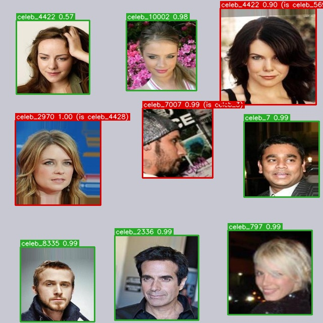

**Partial.** Test split: 6/9 faces detected with the correct identity; confidence 0.57-0.99; identity confusion: celeb_4428 predicted as celeb_2970; celeb_3 predicted as celeb_7007; celeb_5695 predicted as celeb_4422.

### 02_test_0002.jpg

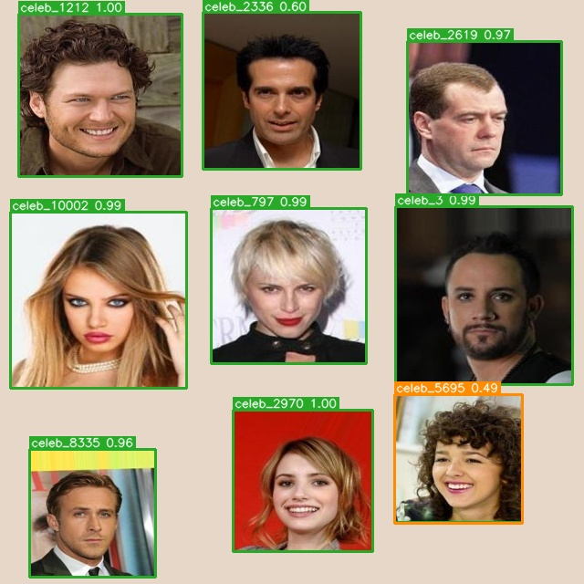

**Success.** Test split: 9/9 faces detected with the correct identity; confidence 0.60-1.00; 1 extra box(es) on background or duplicate faces.

### 03_test_0003.jpg

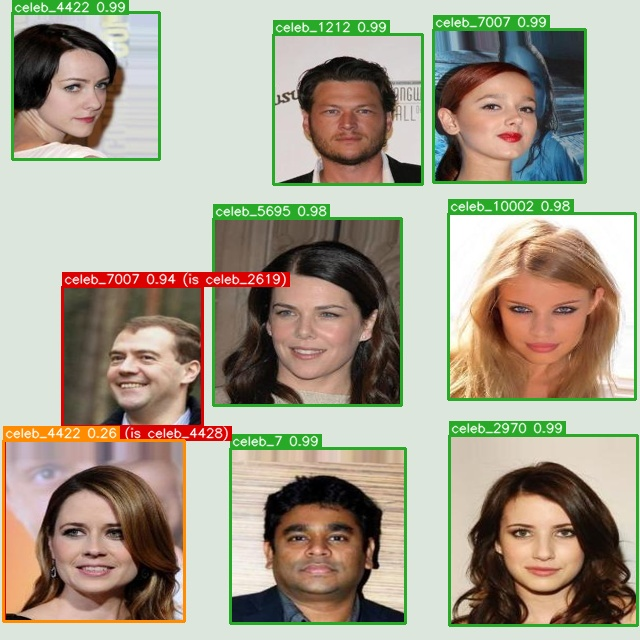

**Partial.** Test split: 7/9 faces detected with the correct identity; confidence 0.98-0.99; identity confusion: celeb_2619 predicted as celeb_7007; celeb_4428 predicted as celeb_2970; 1 extra box(es) on background or duplicate faces.

### 04_test_0004.jpg

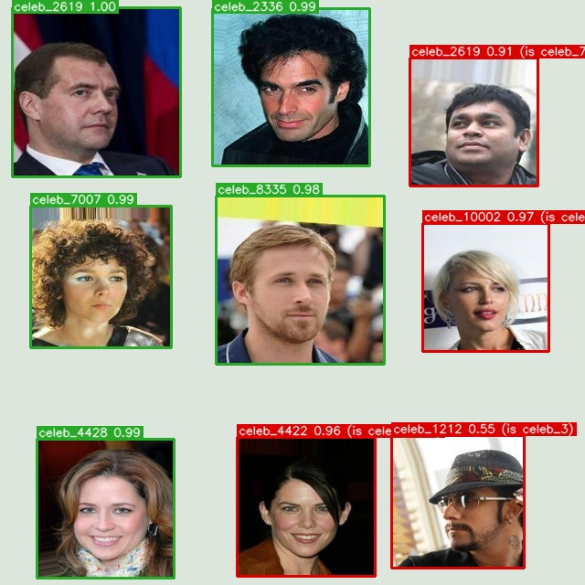

**Partial.** Test split: 5/9 faces detected with the correct identity; confidence 0.98-1.00; identity confusion: celeb_797 predicted as celeb_10002; celeb_5695 predicted as celeb_4422; celeb_7 predicted as celeb_2619; celeb_3 predicted as celeb_1212.

### 05_test_0005.jpg

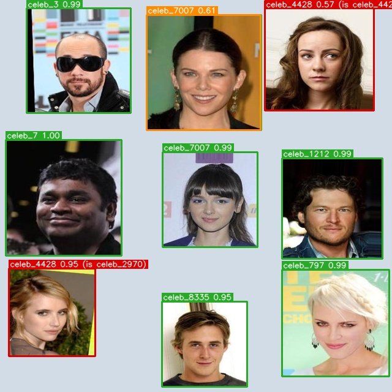

**Partial.** Test split: 7/9 faces detected with the correct identity; confidence 0.80-1.00; identity confusion: celeb_2970 predicted as celeb_4428; celeb_4422 predicted as celeb_4428; 1 extra box(es) on background or duplicate faces.

### 06_test_0006.jpg

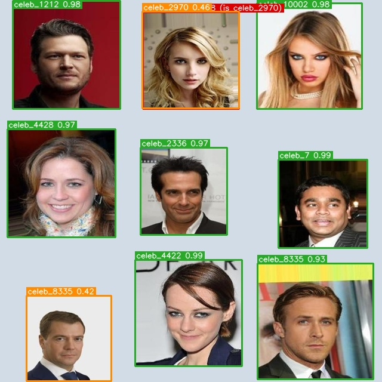

**Success.** Test split: 8/9 faces detected with the correct identity; confidence 0.64-0.99; identity confusion: celeb_2970 predicted as celeb_10002; 2 extra box(es) on background or duplicate faces.

### 07_test_0007.jpg

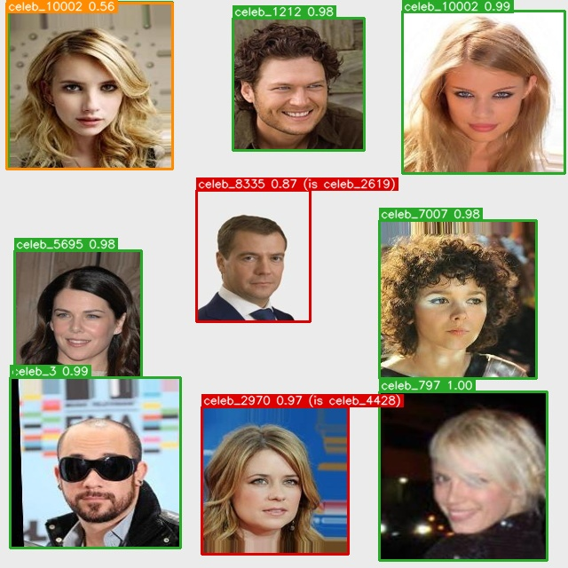

**Partial.** Test split: 7/9 faces detected with the correct identity; confidence 0.84-1.00; identity confusion: celeb_4428 predicted as celeb_2970; celeb_2619 predicted as celeb_8335; 1 extra box(es) on background or duplicate faces.

### 08_test_0008.jpg

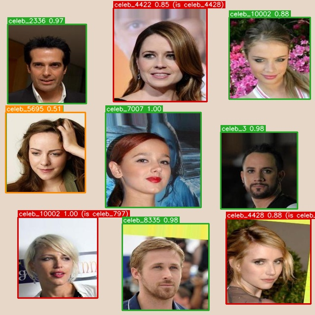

**Partial.** Test split: 6/9 faces detected with the correct identity; confidence 0.54-1.00; identity confusion: celeb_797 predicted as celeb_10002; celeb_2970 predicted as celeb_4428; celeb_4428 predicted as celeb_4422; 1 extra box(es) on background or duplicate faces.

### 09_test_0009.jpg

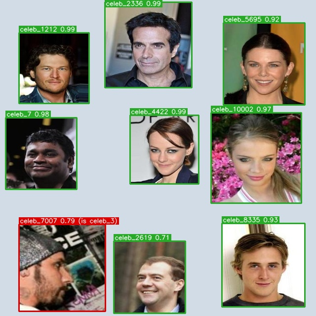

**Success.** Test split: 8/9 faces detected with the correct identity; confidence 0.71-0.99; identity confusion: celeb_3 predicted as celeb_7007.

### 10_test_0010.jpg

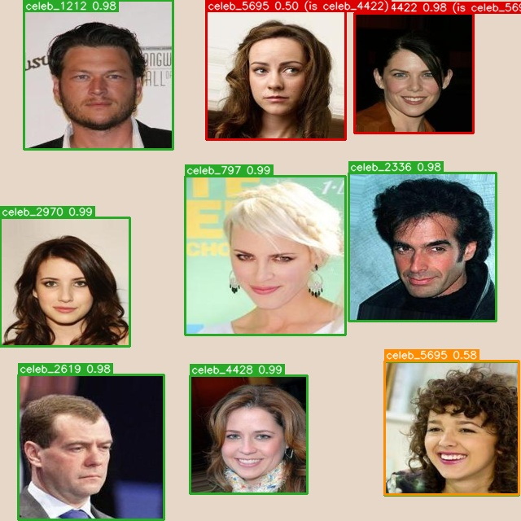

**Partial.** Test split: 7/9 faces detected with the correct identity; confidence 0.59-0.99; identity confusion: celeb_5695 predicted as celeb_4422; celeb_4422 predicted as celeb_5695; 1 extra box(es) on background or duplicate faces.

### 11_test_0011.jpg

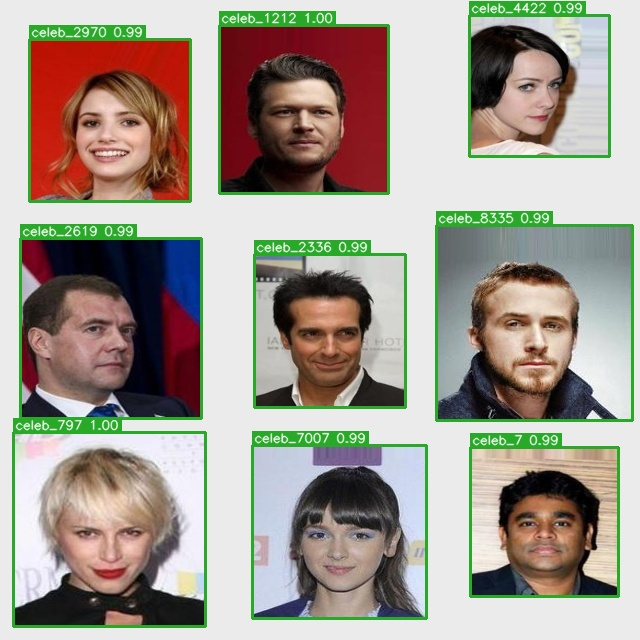

**Success.** Test split: 9/9 faces detected with the correct identity; confidence 0.99-1.00.

### 12_test_0012.jpg

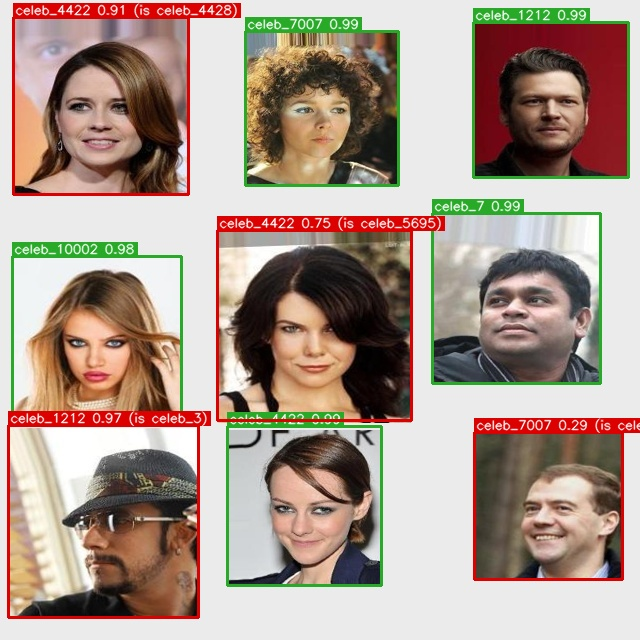

**Partial.** Test split: 5/9 faces detected with the correct identity; confidence 0.98-0.99; identity confusion: celeb_3 predicted as celeb_1212; celeb_4428 predicted as celeb_4422; celeb_5695 predicted as celeb_4422; celeb_2619 predicted as celeb_7007.

### 13_test_0001_small.jpg

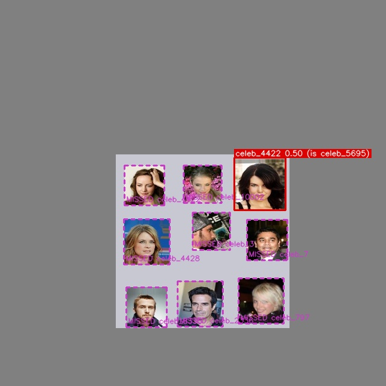

**Failure.** Stress test (faces shrunk to 45%): 0/9 faces detected with the correct identity; missed celeb_2336, celeb_10002, celeb_797, celeb_3, celeb_4422, celeb_4428, celeb_8335, celeb_7; identity confusion: celeb_5695 predicted as celeb_4422.

### 14_test_0001_dark.jpg

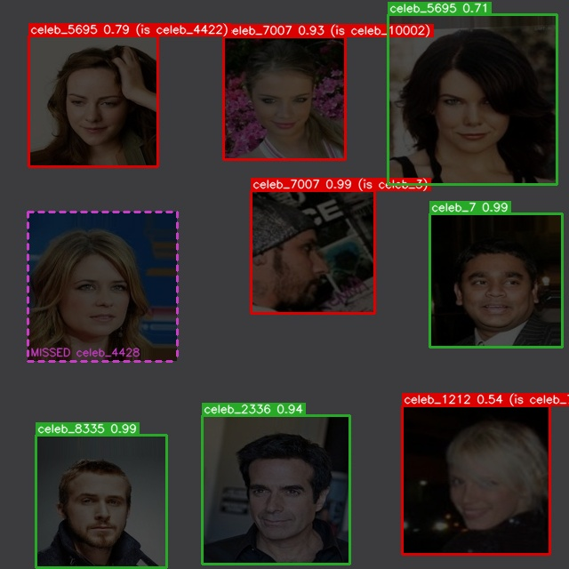

**Failure.** Stress test (exposure cut to 30%): 4/9 faces detected with the correct identity; confidence 0.71-0.99; missed celeb_4428; identity confusion: celeb_3 predicted as celeb_7007; celeb_10002 predicted as celeb_7007; celeb_4422 predicted as celeb_5695; celeb_797 predicted as celeb_1212.

### 15_test_0001_blur.jpg

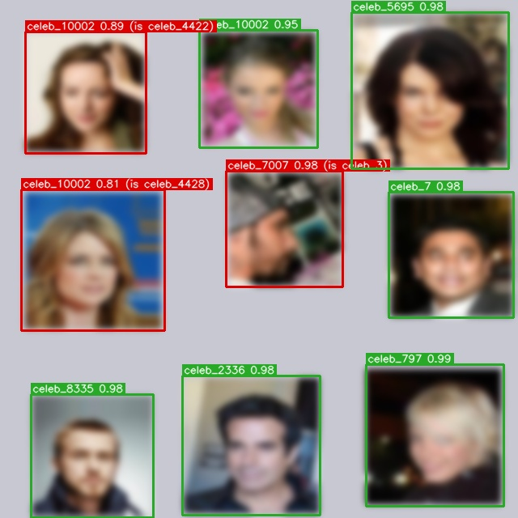

**Partial.** Stress test (heavy blur): 6/9 faces detected with the correct identity; confidence 0.95-0.99; identity confusion: celeb_3 predicted as celeb_7007; celeb_4422 predicted as celeb_10002; celeb_4428 predicted as celeb_10002.

### 16_test_0002_small.jpg

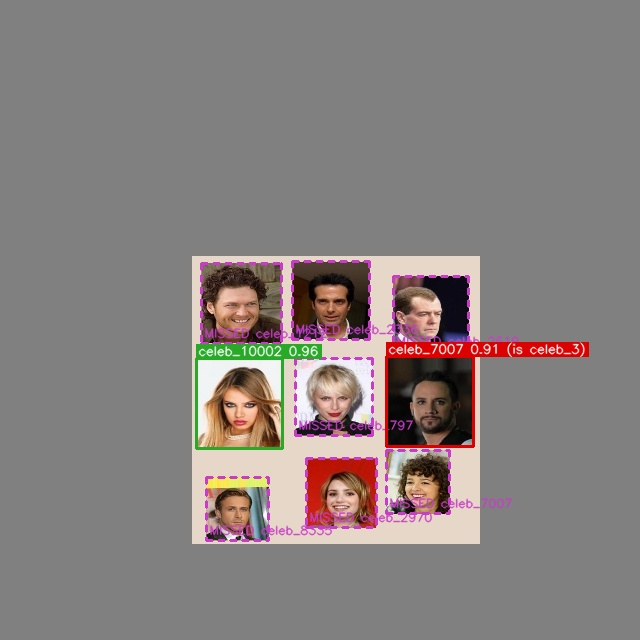

**Failure.** Stress test (faces shrunk to 45%): 1/9 faces detected with the correct identity; confidence 0.96-0.96; missed celeb_2619, celeb_1212, celeb_7007, celeb_2970, celeb_797, celeb_2336, celeb_8335; identity confusion: celeb_3 predicted as celeb_7007.

### 17_test_0002_dark.jpg

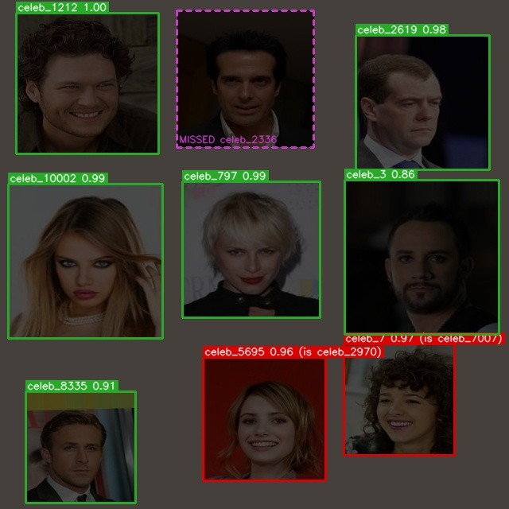

**Partial.** Stress test (exposure cut to 30%): 6/9 faces detected with the correct identity; confidence 0.86-1.00; missed celeb_2336; identity confusion: celeb_7007 predicted as celeb_7; celeb_2970 predicted as celeb_5695.

### 18_test_0002_blur.jpg

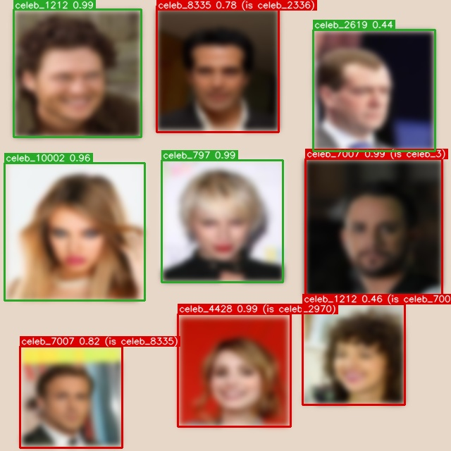

**Failure.** Stress test (heavy blur): 4/9 faces detected with the correct identity; confidence 0.44-0.99; identity confusion: celeb_3 predicted as celeb_7007; celeb_2970 predicted as celeb_4428; celeb_8335 predicted as celeb_7007; celeb_2336 predicted as celeb_8335; celeb_7007 predicted as celeb_1212.

### 19_crowded_two_frames.jpg

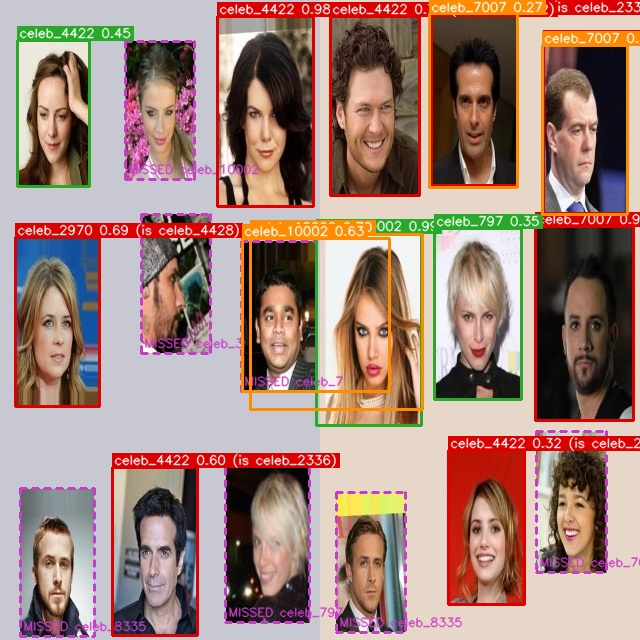

**Failure.** Stress test (two frames squeezed together): 3/18 faces detected with the correct identity; confidence 0.35-0.99; missed celeb_10002, celeb_797, celeb_3, celeb_8335, celeb_7, celeb_7007, celeb_8335; identity confusion: celeb_3 predicted as celeb_7007; celeb_5695 predicted as celeb_4422; celeb_2619 predicted as celeb_4422; celeb_2336 predicted as celeb_4422; celeb_1212 predicted as celeb_4422; celeb_4428 predicted as celeb_2970; celeb_2336 predicted as celeb_4422; celeb_2970 predicted as celeb_4422; 4 extra box(es) on background or duplicate faces.
